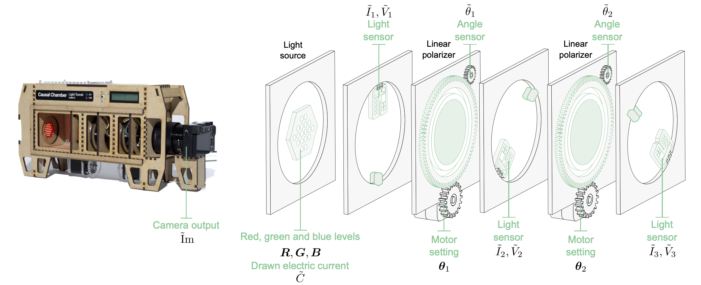

# Sanity Checking Causal Representation Learning on a Simple Real-World System
[](TODO)


Official code repository for the paper **Sanity Checking Causal
Representation Learning on a Simple Real-World System** by
Juan L. Gamella*, Simon Bing* and Jakob Runge.

<p align="center">

</p>

## Setup

Since we include the source code of several different methods as submodules,
these need to be properly initialized and updated. After cloning the main
repository, first run
```
git submodule update --init --recursive
```
and then
```
git submodule update --recursive --remote
```

We recommend installing the required packages in a conda environment. To
do so:
1. Create a new conda environment from the provided config file:
```
conda env create -f environment.yml
```

2. Activate the conda environment:
```
conda activate crc
```


## Experiments

#### Accessing the datasets

The data used for the benchmark is part of the `lt_crl_benchmark_v1` dataset. Additional documentation and download instructions are available in its [dataset page](https://github.com/juangamella/causal-chamber/tree/main/datasets/lt_crl_benchmark_v1) in the [dataset repository](https://github.com/juangamella/causal-chamber) of the Causal Chamber project.

For our experiments, we use `causalchamber` [package](https://github.com/juangamella/causal-chamber-package_internal) to directly download and access the datasets from the Python code. Each dataset is automatically downloaded when running the respective experiment.

### Contrastive CRL
For the real-data experiment using the [Contrastive CRL](https://arxiv.org/abs/2306.02235) method, run

```bash
python contrastive_crl_experiment --dataset lt_crl_benchmark_v1 \
                                  --task contrast_crl_real \
                                  --batch_size 512 \
                                  --epochs 100 \
                                  --lat_dim 5 \
                                  --data_root /path/to/data \
                                  --root_dir /path/to/save/output
```
To run the experiment on the synthetic ablation data, set `--dataset contrast_semi_synth_decoder`
and optionally set the `--task` flag to a name that reflects this change.

### Multiview CRL
The [Multiview CRL](https://arxiv.org/abs/2311.04056) experiment on real data uses the following command
```bash
python multiview_experiment.py --dataset lt_crl_benchmark_v1 \
                               --task contrast_crl_real \
                               --exp_name buchholz_1 \
                               --train_steps 28500 \
                               --batch_size 512 \
                               --lat_dim 5 \
                               --data_root /path/to/data \
                               --root_dir /path/to/save/output
```
For the experiment with synthetic data, set `--dataset chambers_semi_synth_decoder`
and `--exp_name buchholz_1_synth_det`. Optionally, you can also rename the `--task`
flag to reflect this change.

### CITRIS
The [CITRIS](https://arxiv.org/abs/2202.03169) experiment using real data is run with the command
```bash
python citris_experiment.py --dataset chambers \
                            --task contrast_crl_real \
                            --epochs 250 \
                            --batch_size 512 \
                            --lat_dim 16 \
                            --data_root /path/to/data \
                            --root_dir /path/to/save/output
```
To use the synthetic data, set `--dataset chambers_semi_synth_decoder` and optionally change
the `--task` flag to a name that reflects this change.

## Adding methods
In our paper, we only consider a handful of representative CRL methods.
The Causal Chambers are however flexible enough to genrate data that accommodates
the assumptions of virtually any CRL method. If you are interested in applying
existing datasets to a specific method and require support, or wish to collect a new dataset
for a specific experiment, please do not hesitate to reach out! You can either open
a github issue or send us an email.

## Citation
If you find our paper interesting or use the code in this repository,
please consider citing:

```bibtex
@article{gamellabing2025sanity,
  title     = {Sanity Checking Causal Representation Learning on a Simple Real-World System},
  author    = {Gamella*, Juan L. and Bing*, Simon and Runge, Jakob},
  year      = {2025},
  journal   = {arXiv preprint arXiv:TODO},
  eprint    = {TODO},
  note      = {*equal contribution}
}
```
